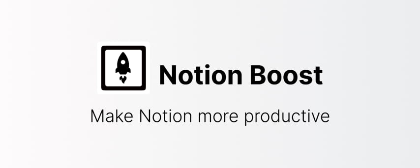

# Notion Boost browser extension

> Browser extension to add features like sticky outline (table of contents), small text & full width by default,scroll to top button, hide slash command menu, hide help button, bolder text and more to Notion.so website.

  

## ⬇ Download

- [Chrome extension](https://chrome.google.com/webstore/detail/notion-boost/eciepnnimnjaojlkcpdpcgbfkpcagahd)
- [Firefox addon](https://addons.mozilla.org/en-US/firefox/addon/notion-boost/)

## How to enable/disable a feature

1. visit any notion page
2. click on the extension icon (clickable only when you are on a notion page)
3. a popup menu will appear, you can toggle features here.

## ✅ Currently added features

### ✔ Show sticky outline

Show sticky outline (table of contents) for pages that have headings or sub-headings. The outline will be shown on the right side of the page. Very useful for navigating a page with lots of content.

### ✔ Set small text & full width for all pages

Option to set small text and full width for all pages by default. This locally adjusts the text and width without clicking on the Notion page toggles. So no page change is saved to the server.

### ✔ 'Scroll to top' button

Added button at the bottom-right corner of page for scrolling back to top. Quite useful for lengthy pages. The button will be visible only when the page has scrolled down a bit.

### ✔ Close Slash command menu after space

Slash command menu which appears when pressing '/' key will be closed back by pressing the space key.

### ✔ Don't show Slash command menu when pressing '/'

Don't show the Slash command menu when pressing '/' key. Slash command menu will still be shown by clicking + ⁝⁝ icon. This setting can't be enabled along with 'Close Slash command menu after space' and vice-versa.

### ✔ Hide floating help button from all pages

This button is located on the bottom-right corner of pages.

### ✔ Bolder text in dark mode

Fix poorly recognizable bold text when using Notion in dark mode

### ✔ Hide comments section from all pages.

comment section is useless when working solo

### ❓ Missing any feature? Suggest [here](https://github.com/GorvGoyl/Notion-Boost-browser-extension/issues/)

---

This is a free and open-source browser extension.

- If you found this extension useful then please support it by rating [★★★★★](https://chrome.google.com/webstore/detail/notion-boost/eciepnnimnjaojlkcpdpcgbfkpcagahd) on chrome/firefox store.
- Follow [@NotionBoost](https://twitter.com/notionboost) on Twitter for upcoming features and other Notion tips.

---

---

## Contribution Guide

This extension uses webpack for module bundling and various other optimizations, ESLint for linting, Prettier for code formatting, and, VSCode for coding <3.  
If you're new to browser extensions, here's an official guide from chrome https://developer.chrome.com/extensions/getstarted

### Structure

`/src/content.js` - page DOM manipulation is done here.
`/src/popup.js` - Javascript related to extension popup

> File an issue if you're not able to setup or run

### Setup

`npm install`

### Run & Debug (for development)

#### Run for Chrome

- `npm run start:ch`
- visit _chrome://extensions/_
- load unpacked extension from folder `\build_chrome`

#### Run for Firefox

- `npm run start:ff`
- visit _about:debugging#/runtime/this-firefox_
- load temp add-on from folder `\build_firefox`

Do your thing in `/src` folder
Raise PR if you would like to contribute something

For rather curious devs:

- Webpack HMR (webpack-extension-reloader) is being used so any changes made to js files will auto reload both extension and browser page to see latest changes.
- To understand run and build process in depth see plugins used in `webpack.config.js`

### Build (for production)

#### Build for Chrome

- `npm run build:ch`
- Output & zip will be in `/build_chrome` folder
- submit extension zip to https://chrome.google.com/webstore/devconsole

#### Build for Firefox

- `npm run build:ff`
- Output, zip, source code zip will be in `/build_firefox` folder
- submit extension zip https://addons.mozilla.org/en-US/developers/addon/notion-boost/versions/submit/
- submit source code zip
