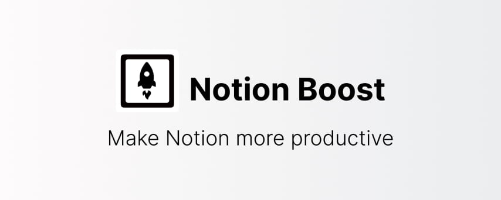

# Notion Boost browser extension

> Browser extension to add 20+ features to Notion.so like sticky outline (table of contents), small text & full width by default,scroll to top button, hide slash command menu, hide help button, bolder text and more.

  <a
    title="Chrome extension link"
    href="https://chrome.google.com/webstore/detail/notion-boost/eciepnnimnjaojlkcpdpcgbfkpcagahd"
    target="_blank"
    rel="noopener"
    ></a
  ><a
    title="Chrome extension link"
    href="https://chrome.google.com/webstore/detail/notion-boost/eciepnnimnjaojlkcpdpcgbfkpcagahd"
    target="_blank"
    rel="noopener"
    ></a
  ><a
    title="Chrome extension link"
    href="https://chrome.google.com/webstore/detail/notion-boost/eciepnnimnjaojlkcpdpcgbfkpcagahd"
    target="_blank"
    rel="noopener"
    ></a
  ><a
    title="Firefox addon link"
    href="https://addons.mozilla.org/en-US/firefox/addon/notion-boost/"
    target="_blank"
    rel="noopener"
    ></a
  >

## 🏠 Homepage

https://gourav.io/notion-boost

### ⬇ Downloads

- Chrome/Edge/Brave extension - https://chrome.google.com/webstore/detail/notion-boost/eciepnnimnjaojlkcpdpcgbfkpcagahd
- Firefox addon - https://addons.mozilla.org/en-US/firefox/addon/notion-boost/

### ⭐ All Features

https://gourav.io/notion-boost#-currently-added-features

Missing some feature? [suggest it](https://github.com/GorvGoyl/Notion-Boost-browser-extension/issues)

See what's new in latest update: https://gourav.io/notion-boost/whats-new

---

#### 👍 Liked this extension? express your love by rating [★★★★★](https://chrome.google.com/webstore/detail/notion-boost/eciepnnimnjaojlkcpdpcgbfkpcagahd) on Chrome/Firefox store.

<!-- #### ✨ Follow [@NotionBoost](https://twitter.com/intent/follow?user_id=1312809481240154112) on Twitter for many amazing Notion tips & tricks. -->

#### 👨‍💻 See my other projects: https://gourav.io

---

#### Looking for Notion Desktop App?

Use **Notion Enhancer**: https://notion-enhancer.github.io/

---

### 🙏 Credits

- Notion Community for supporting and sharing this project.
- [Notion Enhancer](https://github.com/notion-enhancer/desktop) project.
